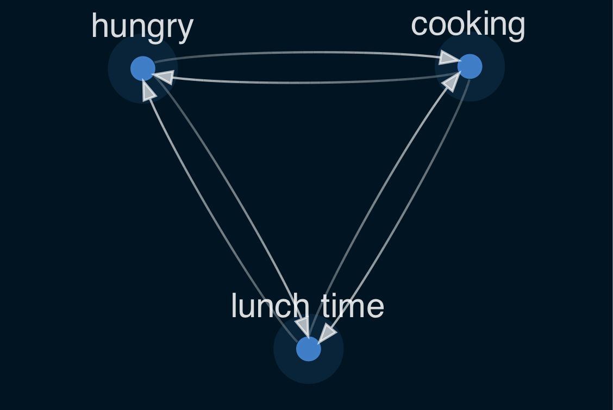
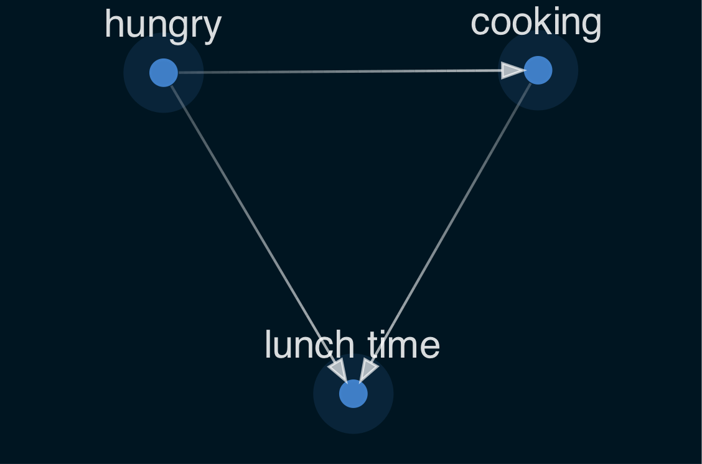
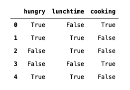
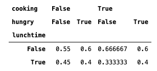
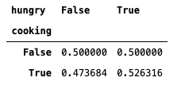
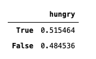
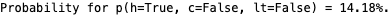
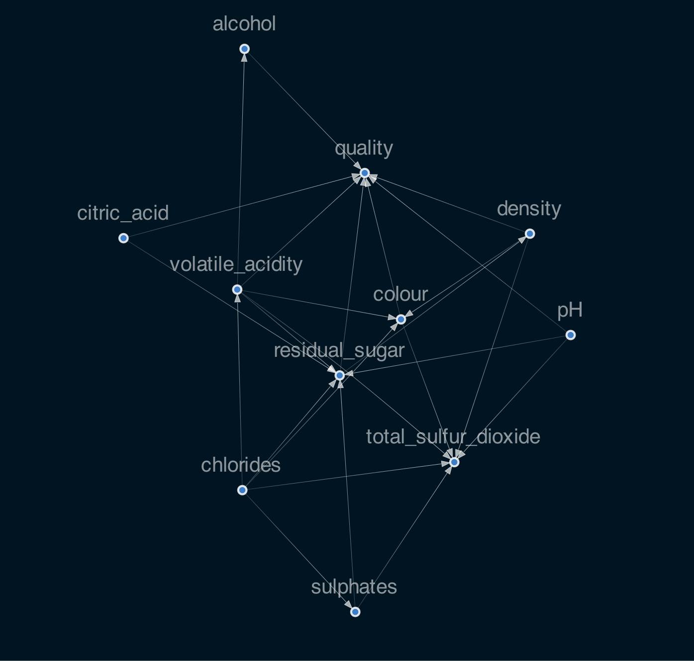

# Bayesian Networks: Combining Machine Learning and Expert Knowledge into Explainable AI

Modern machine learning models often result in hard to explain black box situations, where the inputs are known, but the path to the output and predictions less so. If in addition to this, data is limited, or even too small to learn all intricacies hidden in the data, it can become hard to get meaningful results from the data and have high confidence in them. 
Without labour-intensive, detailed work it is hard to encode expert knowledge beyond difficile feature engineering.

<!--
There are many tools available out of the box, e.g. [autoated machine learning](https://en.wiki.org/wiki/automated_machine_learning), making machine learning easily accesible to everyone for very specific usecases. It is often pricey and there is no understanding of the underlying mechanisms. 
-->

In contrast, at [Eliiza](https://eliiza.com.au) we create bespoke solutions perfectly tailored to your specific needs and demands. One of the methods in our arsenal are Bayesian Networks. These allow for both quick, good results as well as expert input, allowing for better models even on small datasets. Moreover, querying a Bayesian Network gives immediate insight into the importance and influence of each variable on a desired outcome.

In case of important business decisions, confidence in results is necessary. Bayesian Networks help with this, by allowing for the intrinsic calculation of confidence scores, which most machine learning methods cannot and/or must be costly computed post-hoc. 

The results discussed here can be found in the notebook which can be found [here]().
## Introduction to Bayesian Networks and Graphs

Bayesian networks operate on graphs, which are objects consisting of "edges" and "nodes". As an example, the image just below shows a graph describing the situation around lunchtime with three nodes (Hungry, cooking, lunchtime), and edges between them (arrows).

_A simple graph created around around lunchtime._

This graph is not a good description of reality, as being hungry does not depend on it being lunchtime (it could also be dinner time).

Implementing this "expert" knowledge, the graph is turned into a [directed acyclic graph (DAG)](https://en.wikipedia.org/wiki/Directed_acyclic_graph), as shown in Figure 2. Among other things, this graph encodes that cooking something may mean it is lunch time, but it being lunch time does not mean one is cooking something - one could also be eating out afterall or go hungry. 

_Example of a directed acyclic graph._

Thus, in contrast to most machine and deep learning methods Bayesian Networks allow for immediate and direct expert knowledge input. The graphs allow for easy encoding of knowledge into a directed acyclic graph (DAG), by controlling both the direction and existence of edges between nodes.

### The Joint Probability and Conditional Probability Distributions

Having built a graph to match our problem, we can now encode the problem  in probabilities, the basis of which will be the [joint probability distribution](https://en.wikipedia.org/wiki/Joint_probability_distribution):

p(h,c,lt) = p(lt|h,c)\*p(c|h)\*p(h)

which says that the probability for "hungry (h) and cooking (c) and lunch time (lt)" is the same as the probability of it being "lunch time times the probability I am cooking given I am hungry times the probability I am hungry". Effectively, this single equation encodes our entire problem, nodes and edges, which can be used to create inferences on our graph.

Building a joint probability distribution covering all the different cases is tedious and expensive, whereas looking at the individual conditional probability distributions is a lot quicker and easier, especially as the [Bayes Theorem](https://en.wikipedia.org/wiki/Bayes%27_theorem) can be employed to simplify some terms.

## Inference on Bayesian Networks

Having encoded our expert knowledge on this situation, the next step is to ready ourselves for some inferences, to make predictions.

Assuming I gathered some data over the course of a week, I should have a table similar to this:

From this table, we need to create the conditional probability tables p(lt|h,c), p(c|h), and p(h).

These probabilities tables describe the relation between the different variables. Plugging these values into the joint probability function from above, we can calculate for example the probability of being hungry, while not cooking and it not being lunch time:

For larger problems, we will want to automate by using our python package of choice (e.g. [pymc3](https://docs.pymc.io/), [pomegrenate](https://pomegranate.readthedocs.io/en/latest/), [causalnex](https://causalnex.readthedocs.io/en/latest/index.html), or others).

## Applying Bayesian Networks to a Real World Problem:

As a real world application, let's take a look at the [wine quality dataset](https://archive.ics.uci.edu/ml/datasets/Wine+Quality). It is interesting because it features outliers, and several variables that are not directly related to a wine's quality. 

A quick look at the data reveals, that, besides wine `colour` and `quality`, all variables follow a roughly log-normal shape. The correlations matrix, which contains the correlation between each of the variables, shows that only alcohol (0.44) and density (-0.31) show a certain correlation to the wine quality. 

Creating a directed acyclic graph (DAG) to describe data, if done exactly, is computationally quite expensive, as the structure finding problem scales super exponential with the amount of variables/nodes. A shortcut to circumvent this is the [NOTEARS-algorithm](https://papers.nips.cc/paper/8157-dags-with-no-tears-continuous-optimization-for-structure-learning.pdf), which reduces the computational complexity to about O(n³). 
In this case, the NOTEARS inferred graph was augmented with "expert knowledge" of an infrequent wine drinker, and some edges added, some removed.

Fit to Problem 84.4% AUC

###### TABLE 1 cpd table

At this point, for the first time the bayesian nature of the problem enters. throu
As a graph, it would look something like this:

 

As the entire distribution of values is approximated, confidence intervals can be [calculated](https://mae.ufl.edu/nkim/Papers/paper92.pdf) - invaluable if not just a number, but also the uncertainty need to be known.
